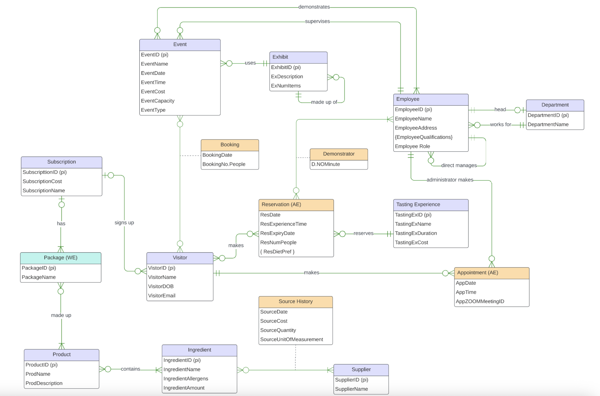

## Project 1: Chocolate Nation Museum - Database Design & Business Analysis ##
_Project Overview:_
Led a team of four to design and implement a comprehensive **relational database system** for Chocolate Nation's expansion into Australia. The project involved **analyzing complex business operations**—including event bookings, tasting experiences, inventory management, and subscription services—and **translating them into a scalable, normalized data model**. This system **centralizes data to drive operational efficiency, enhance visitor experience, and provide actionable business insights.**

_Key Responsibilities & Role:_
* **Project Lead:** Managed project timelines, delegated tasks, and ensured the final deliverable was polished and met all specifications.
* **Business Analyst:** Translated vague business requirements into clear technical specifications and data models.
* **Data Modeler:** Architected the conceptual and logical database models to accurately represent business entities and their relationships.
* **SQL Developer:** Engineered complex SQL queries for data analysis and reporting.

_Technical Skills Demonstrated:_
* **Database Design:** Created a detailed **Entity-Relationship Diagram (ERD) using Crow's Foot notation** in Lucidchart.
* **Data Modeling:** Performed **logical transformation** from conceptual ERD to **a normalized relational schema**, defining **primary keys, foreign keys, and table structures**.
* **SQL Programming:** Wrote robust **DDL (Data Definition Language)** to create **tables and DML (Data Manipulation Language)** for data insertion and complex querying.
* **Database Management:** Designed for complex business logic, including:
  * **Recursive Relationships** (e.g., Exhibits containing sub-exhibits)
  * **Many-to-Many Relationships** (e.g., Bookings, Product-Ingredient sourcing)
  * **Weak Entities** (e.g., Subscription Packages)
* **Historical Tracking** (e.g., SourceHistory for ingredient pricing and suppliers)
* **Tools Used:** **Lucidchart, MySQL, Git**

_Project Deliverables:_

**1. Conceptual ER Diagram:**
  * Designed to capture all **business entities**: Event, Exhibit, Visitor, Employee, Tasting Experience, Product, Ingredient, Supplier, and Subscription.
  * **Mapped complex relationships with precise cardinality** (e.g., A Reservation involves one Visitor and three Demonstrators).
  * **Visual:** 

**2. Logical Data Model** ([Logical Transformation](Project1/LogicalTransformation.md) for details):
  * Transformed the ERD into a detailed **logical model** with a complete set of tables, attributes, and keys.
  * Implemented **solutions for multi-valued attributes** (EmployeeQualifications, ResDietPref) and associative entities (Booking, SourceHistory).

**3. SQL Database Implementation** ([SQL queries](Project1/SQL_queries.md) for details):
  * **Schema Creation:** Built the **DDL for the operational database tables**.
  * **Data Population:** Inserted meaningful **sample data into all tables** to test integrity and relationships.
  * **Advanced Queries:** Developed **analytical SQL queries** to derive business value, including:
    * Single-table conditional queries to **filter promotional discounts**.
    * Wildcard searches to **find specific product** types.
    * Multi-table joins to **analyze customer review patterns.**
    * Aggregate functions with **GROUP BY** to **calculate average monthly review** ratings, providing a **key performance indicator (KPI) for customer satisfaction**.
   
_Business Impact:_

The designed database provides a single source of truth for Chocolate Nation's Australian operations, enabling:

* **Streamlined booking** and **reservation processes**.
* **Efficient management** of events, inventory, and supplier relationships.
* **Data-driven decision-making through analytical querying** (e.g., identifying popular products, tracking customer satisfaction trends).

